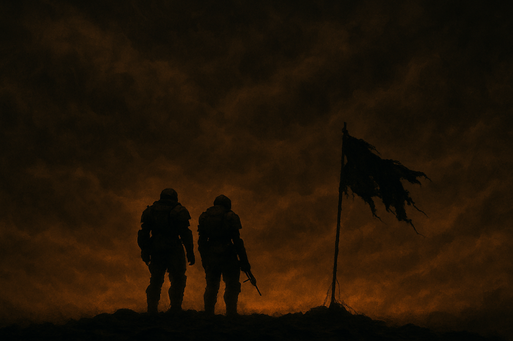


## Croiseur – Salle de Commandement

La Destruction Créatrice, croiseur de combat immatriculé FST-CC-S65-1827391, décrivait une orbite lente autour de *La Crique de Malevelon*, planète jadis prometteuse désormais embrasée par les flammes de la guerre.

Depuis la salle de commandement, le monde en contrebas ressemblait à une vive blessure : des cratères béants, des villes réduites en cendres, des forêts calcinées et des lueurs intermittentes qui peinaient à percer l’épais manteau de brume.

Le capitaine de vaisseau Nix passait les écrans de contrôle au peigne fin. 

La mission devait être à faible risque : détruire les réserves de carburant, planter le drapeau de la démocratie, transmettre les données de reconnaissance, s’extraire. En cas de résistance, neutraliser les forces hostiles. En théorie.

En pratique, vingt-trois soldats d’élite, les *Helldivers*, étaient déjà tombés. À présent, il ne restait plus que deux survivants de l’escouade Alpha-6 sur le terrain, accrochés au dernier objectif prioritaire : tenir le drapeau pendant la transmission des données.

Sur les moniteurs, leurs signes vitaux pulsaient faiblement, brouillés par les tempêtes ioniques qui fouettaient l’atmosphère. Les communications grésillaient.

Nix fronça les sourcils. À force de le côtoyer, l’équipage avait appris à lire les infimes nuances de son attitude : il suffisait d’un pli discret au coin des yeux ou d’une tension fugace de la mâchoire pour trahir ce qu’il ne disait jamais. Les ordres, eux, tombaient sans fioriture ni inflexion, avec une efficacité qui semblait empruntée aux *Automatons*. Il ne parlait pas de loyauté, mais l’incarnait.

Un opérateur leva la tête : « Capitaine, les capteurs détectent une concentration ennemie qui converge vers la position d’Alpha-6. Trois cents unités d’*Automatons*, peut-être plus. »

Nix ne cilla pas. Il connaissait ces chiffres, ces probabilités. Il avait envoyé tant d’hommes et de femmes dans des situations similaires. Quelques-uns revenaient. Pour la plupart, c’était un aller simple. Telle était la nature de cette guerre : un lent enlisement, nourri de sacrifices calculés, de pertes tolérables. Il posa la main sur le rebord du pupitre, les doigts crispés.

« Temps estimé avant contact ennemi ? » demanda-t-il d’une voix neutre.

Un silence. Puis : « Trois minutes, mon capitaine. »

Nix hocha lentement la tête. Il n’y aurait pas d’évacuation. Il le savait. Les deux *Helldivers* au sol aussi. C’était inscrit dans leur contrat, dans leur serment, dans chaque mission qu’ils acceptaient. Mourir pour la Super-Terre ; mourir pour que d’autres vivent.

Il détourna les yeux vers l’astre et murmura d’une voix si peu audible que personne ne l’entendit : « Tenez bon. »

## Malevelon – Équipe Alpha-6

Le sol tremblait sous la cadence mécanique des pas d’acier qui martelaient la terre scarifiée. L’air était épais, saturé de fumée et de cendres, chaque inspiration râpait la gorge comme du verre pilé. Le ciel semblait, lui aussi, infiniment loin, étouffé par un plafond de nuages que les explosions éclairaient par instants.

Derril et Elera se tenaient dos à dos, au centre d’un périmètre dévasté. Leurs armures, autrefois rutilantes aux couleurs de la Super-Terre, n’étaient plus que plaques cabossées et joints noircis. Le drapeau de la démocratie, planté dans un amas de gravats et de boue, flottait encore malgré ses déchirures.

Derril vérifia son fusil d’assaut une dernière fois. Le chargeur était presque vide. Elera rechargea son arme avec des gestes précis, presque rituels. Sa main effleura le pendentif qui pendait à son cou : une petite étoile bleue, souvenir d’une vie d’avant. C’était son préféré : il changeait légèrement de couleur lorsque sa température approchait celle du corps humain, une pâleur glacée virant à un bleu plus profond au contact de la peau. Elle le serra brièvement dans sa paume.

Derril, sans être du genre à croire aux talismans, se surprenait parfois à se demander si ce collier n’avait pas un lien avec toutes les situations désespérées dont Elera était ressortie vivante. Elera n’y croyait pas vraiment, ou s’en défendait, mais l’idée s’enracinait un peu plus à chaque combat.

Par centaines, les silhouettes ennemies émergèrent du brouillard comme des spectres d’acier aux yeux rouges. Le vrombissement de leurs moteurs formait une symphonie discordante, presque hypnotique. Ils avançaient méthodiquement, sans hâte.

Derril jeta un œil au radar : brouillé. Il changea de fréquence pour solliciter un appui aérien. Indisponible.

Derril tourna la tête vers le transmetteur de données dont les voyants clignotaient par à-coups.
« Tout ça pour quelques mégaoctets de données… »  
Il eut un rictus amer : « J’espère au moins qu’ils en feront un joli graphique. »  

Puis il chargea son arme.

Sans un mot de plus, ils s’élancèrent ensemble dans l’obscurité. Les premiers tirs jaillirent, traçant des lignes de feu. Derril abattit sept *Automatons* avant d’épuiser ses munitions. Il dégoupilla une grenade, la lança dans la masse grisâtre et se jeta en avant. La déflagration le projeta en arrière, disloquant l’armure comme une coquille de noix.

Elera vida son chargeur en rafales courtes, précises ; chaque balle trouva sa cible. Mais ils étaient trop nombreux. Toujours trop nombreux.

Une salve la faucha aux jambes. Elle s’effondra, lâcha son fusil, puis se redressa, à genoux, le casque brisé. D’une main, elle arracha le pendentif de son cou et l’empoigna. De l’autre, elle dégaina son pistolet et reprit le tir. Son visage était maculé de sang et de terre. Elle n’eut le temps que d’une respiration avant que les balles ne la transpercent.

Le vacarme s’estompa.

## Retour au croiseur

Les signaux des rescapés d’Alpha-6 vacillèrent en rouge, puis s’éteignirent complètement.

« Mission terminée. » L’officier de liaison poursuivit : « Équipe Alpha-6 : hors de combat. Renfort indisponible, budget épuisé. Données : transmises. Statut global : succès. Pertes humaines : 25. »

Nix hocha la tête, le visage impassible. « Enregistrez les coordonnées pour archivage. Transmettez les notifications aux familles. Protocole standard. »

« Bien, mon capitaine. »

Après un moment d’hésitation, l’opérateur ajouta : « Les drones signalent une recrudescence significative d’activités ennemies. Recommandation : réévaluation du statut sectoriel en *Zone pacifiée à risque modéré*. »

Nix ne répondit pas. Il s’éloigna de la console, marchant lentement vers la verrière. Deux noms de plus sur la liste. Il pensa à Derril et Elera. Non : à Alpha-6, parce qu’il était plus facile de penser à des matricules qu’à des visages. Plus simple de signer des ordres en oubliant que chaque point lumineux sur l’écran avait été une personne, avec des rêves, des peurs, une famille.

Il ferma les yeux un instant, s’autorisant cette faiblesse. Puis il les rouvrit et redevint le capitaine de vaisseau, celui qui devait continuer, qui devait envoyer d’autres *Helldivers* pour qu’une ligne sur la carte avance d’un centimètre.

Sur le réseau public de la Super-Terre, une note s’afficha brièvement :

> *Succès tactique sur La Crique de Malevelon. Objectif primaire atteint. Gloire aux Helldivers morts au champ d’honneur. La démocratie contrôlée progresse. Leurs sacrifices ne seront jamais oubliés.*

Le message resta visible une poignée de secondes, puis fut remplacé par un bulletin d’information sur un autre front ouvert dans le secteur des *Terminides*. Les noms de Derril et Elera ne furent pas mentionnés.

Nix se tenait seul dans son bureau, une coupe à la main. Il leva le verre vers *La Crique* qui s’éloignait déjà dans l’immensité, puis le reposa sans boire.

Il se retourna vers son moniteur. Un nouvel ordre de mission attendait. Secteur *Xzar*. Objectif : détruire les relais de communication ennemis. Valeur stratégique : élevée. Pertes estimées : élevées. Présence ennemie estimée : modérée.

Il s’assit, prit son stylet et signa.

La Destruction Créatrice corrigea sa trajectoire et mit le cap vers la nouvelle destination. Derrière lui, un bourgeon de station de rechargement *Automaton* émergeait déjà là où deux soldats avaient perdu la vie quelques jours plus tôt. Les robots avaient arraché le drapeau et effacé presque toute trace. Coincé dans une grille tordue, un minuscule éclat du pendentif d’Elera accrochait encore la lumière.

Un drone d’assainissement s’approcha. La tête d’aspiration descendit. L’éclat disparut.


---


Sous ses allures de jeu de tir à la troisième personne, *Helldivers 2* se distingue par un concept unique : les batailles menées par les joueurs du monde entier influencent en temps réel le scénario officiel. Le jeu devient ainsi le support d’une métacampagne où chaque action collective s’inscrit dans le canon, donnant à la communauté un rôle actif dans le déroulé des événements de la fiction.

La nouvelle s’ancre dans cet univers, né d’une forme de dialogue entre le studio et les joueurs. *Helldivers 2* ne raconte pas de grandes histoires : il en esquisse les contours, laissant aux joueurs le soin de les remplir. Ce silence narratif est à la fois une faiblesse et un espace de liberté. D’ordinaire, les objectifs majeurs tombent, sont accomplis, puis s’oublient. Au premier rang des exceptions, figure *La Crique de Malevelon*, une débâcle devenue récit fondateur.

*Fiction non officielle inspirée du lore de Helldivers (Arrowhead/Sony). Aucune exploitation commerciale.*

